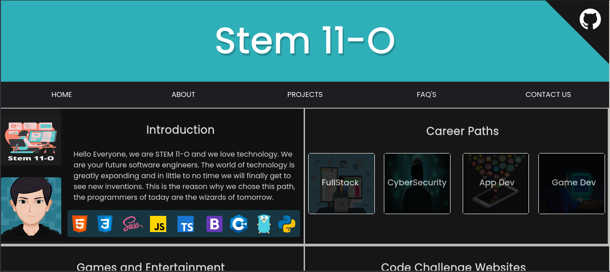

## :octocat: Stem-O Main Homepage

Main Homepage website for Stem-O.

## Tools and Languages Used

| **Programming Languages** |  	    | 
:--- | :---
| **Tools** |     |

## Installation
```bash
git clone https://github.com/Stem-O/stem-o.github.io
```
## Demo


## Note
<p>
  Please do not copy the code without asking permission, this is for Stem-O alone. If you wish to copy
the source code kindly contact email [owner](s1170044@usls.edu.ph).
  </p>

## Contributing
<p>
Pull requests are welcome. For major changes, please open an issue first to discuss what you would like to change.
Please make sure to update tests as appropriate.
  </p>

## Developer
[FonderElite](https://github.com/fonderelite)
